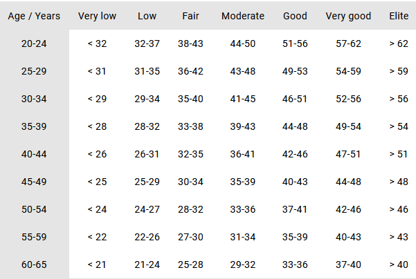

# First time use

First time use (FTU) is the process of configuring the device. The `doFirstTimeUse()` is the function that needs to be called 

# First time use config

As a parameter of the `doFirstTimeUse()` function needs to be passed a configuration that contains all necessary data that needs to be set.

## User's gender

Although incorrectly named gender, this value should match the user's biological sex to produce the most accurate guidance. 

## HR Rest

Resting heart rate is the heart rate when a person is fully awake at a full rest ( ex: lying down ). Heart rate rest can be calculated using HR measurement when the user is at complete rest for a few minutes, but otherwise a setting a default value of `60` is a good starting point. 

## HR max

Theoretical maxmimum heart rate can be calculated by a simple formula such as `220 - age`, which has its limitation but is a good starting point when not knowing what is the user actual maximum heart rate.

## VO2 max

Please read this [Polar blog](https://www.polar.com/blog/vo2max/) about VO2 max. VO2 max can be calculated by Polar wirst units by doing a [fitness test](https://www.polar.com/blog/lets-talk-polar-polar-fitness-test/) or using FlowApp with sensors such as Polar Verity Sense or Polar H10.

This table represents what values should be used as an input, if the actual user's VO2 max is not known : 

### Male VO2 max table

### Female VO2 max table

TODO: Add vo2 max estimation algorithm based on age, weight, height and sex.

## Sleep goal

A sleep goal can be between 5 and 11 hours of time. It corresponds to the user's sleep target time, which is slightly different for everyone. That metric is used for sleep guidance.

## Typical day

The typical is used for activity guidance. It defines the activity goal of the person with is a percentage that goes from 0 to 100% while activity guidance judges that users has reached his daily activity goal. Three levels are defined, from the most sendentary to active : 

- Mostly sitting
- Mostly standing
- Mostly moving